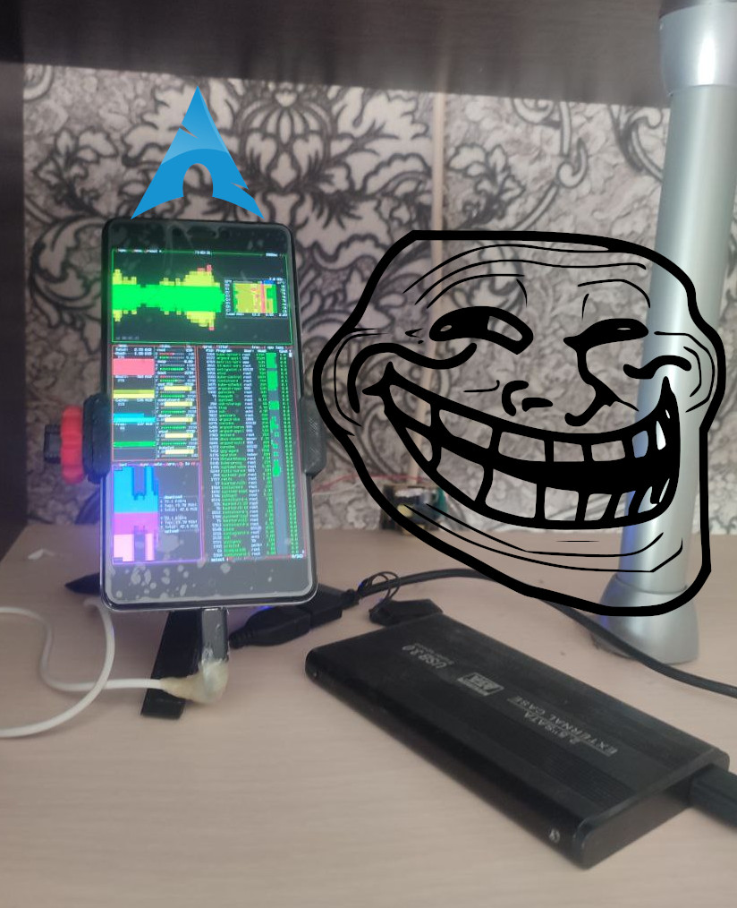

# GitOps Kubernates ☸️

[](#)

> Проект выполнен **Just for Staff**.
(*в образовательных целях)

## 📌 О проекте

Проект развёрнут на устройстве с архитектурой **ARM64v8**, **3 ГБ RAM**, **16 ГБ SSD**.

Цели проекта:

-   Разработка и запуск воспроизводимого кластера Kubernetes.
-   Изучение основных компонентов Kubernetes и их взаимодействия.
-   Настройка CI/CD с использованием **ArgoCD**:
    -   Автоматический деплой приложений из git-репозитория (манифесты/Helm charts).
    -   Управление приложениями через `Application` и `ApplicationSet`.
    -   Деплой из приватного Docker Registry.
-   Настройка **Traefik** для reverse proxy и автоматического TLS:
    -   Настройка API Gateway и ingress.
    -   Работа с HTTPRoute, IngressRoute, Ingress.
    -   Проксирование трафика на Python-приложения.
-   Настройка мониторинга:
    -   **Metrics-server** — базовые метрики.
    -   **Prometheus** — расширенные метрики.
    -   **Tempo** — распределённые трейсы.
    -   **Grafana** — UI для визуализации метрик.

---

## ✅ Реализованные фичи

-   **ArgoCD**
    -   Настроена система CD с GitOps подходом.
    -   Автоматический деплой сервисных приложений.
-   **Traefik**
    -   Настроен как Ingress Controller и API Gateway.
    -   Автоматическое управление TLS сертификатами.
-   **Monitoring**
    -   Подняты Prometheus, Grafana, Metrics-server и Tempo.

---

## 🌐 Доступные URL

| Сервис                    | URL                                                          |
| ------------------------- | ------------------------------------------------------------ |
| Фронтенд                  | [http://chiz.work.gd](http://chiz.work.gd)                   |
| REST API                  | [http://chiz.work.gd/api](http://chiz.work.gd/api)           |
| API Docs (Swagger)        | [http://chiz.work.gd/api/docs](http://chiz.work.gd/api/docs) |
| Приватный Docker Registry | [http://reg.chiz.work.gd](http://reg.chiz.work.gd)           |
| Web UI Docker Registry    | [http://reg.chiz.work.gd/ui](http://reg.chiz.work.gd/ui)     |
| Kubernetes Dashboard      | [http://kub.chiz.work.gd](http://kub.chiz.work.gd)           |
| Traefik Dashboard         | [http://traefik.chiz.work.gd](http://traefik.chiz.work.gd)   |
| Grafana Dashboard         | [http://grafana.chiz.work.gd](http://grafana.chiz.work.gd)   |

---

## ⚡ Использование

### Развёртывание локального кластера

```bash
## Создать локальный кластер
sudo kubectl create cluster --config=clusters/dev/cluster-config.yaml
```

## ⚠️ It's Slow As Hell 🐢
**The project has ended. Time to move on…**